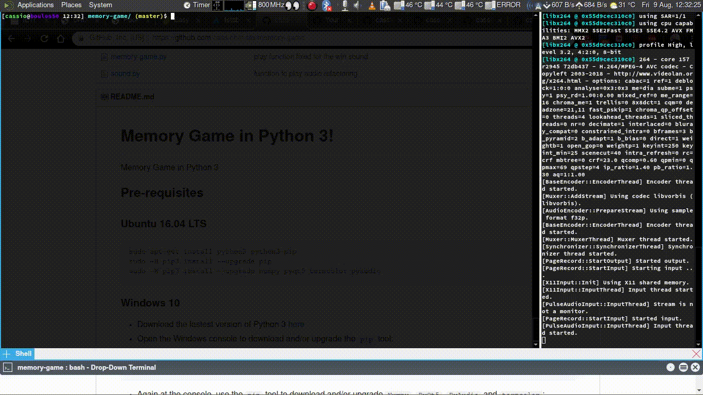

# Memory Game in Python 3!



## Pre-requisites

### Ubuntu 16.04 LTS
```
sudo apt-get install python3 python3-pip portaudio
sudo -H pip3 install --upgrade pip
sudo -H pip3 install --upgrade numpy pyqt5 termcolor pyaudio
```

### Windows 10
- Download the lastest version of Python 3 [here](https://www.python.org/downloads/)
- Open the Windows console to download and/or upgrade the `pip` tool:    
```
python -m pip install --upgrade pip
```     
- Again at the console, use the `pip` tool to download and/or upgrade `Numpy`,
  `PyQt5`, `PyAudio` and `termcolor`:     
```
pip install --upgrade numpy pyqt5 termcolor pyaudio
```

## Execution

```
cd path/to/memory-game
python ./memory-game.py # for Ubuntu: python3 ./memory-game.py
```
